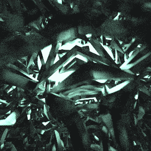

# Everyday One Motion - 20160609 "Metal IFS, Glowing Metaball"  

  

JavaScript, WebGL, Raymarcher, Pathtracer  

[Everyday One Motion](http://motions.work/motion/262)  
[Demo Page](http://fms-cat.github.io/eom_20160609)  

## モンテカルロ法の2D解説

は今週は忙しくてできませんでした……  

## Metal IFS

メタリックな材質の再現は、鏡面物体の反射ベクトルにランダムなベクトルをちょっぴり足すことにより実現しています（説明がムズい）。  

## Glowing Metaball

モンテカルロパストレーシングを使えば、頭空っぽにしても任意の物体を発行させることが可能なので、最高ですね！計算負荷はヤバイですが。  
